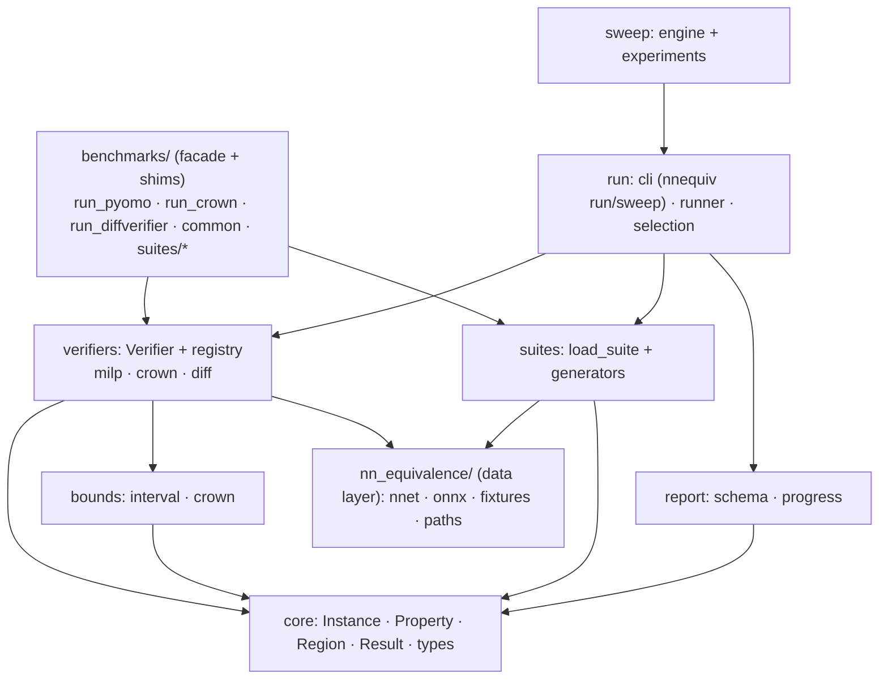

# Architecture

This repo is a **verifier-comparison harness** for neural-network *equivalence*:
given two networks and an input region, do they agree (within ε, or on argmax)
everywhere in the region? It runs several verifiers over shared benchmark suites
and reports comparable results:

- **Relational-MILP** — the novel method: encode "the two networks differ by more
  than ε somewhere" as a MILP, solve with CPLEX via Pyomo.
- **α-β-CROWN** — an external SOTA verifier, driven through its Python API.
- **ReluDiff / NeuroDiff** — external C verifiers (`delta_network_test`), driven
  by subprocess.

The codebase is organised around one idea: **a `Verifier` is `(Instance) →
InstanceResult`.** Everything else — the CLI, the result schema, the sweeps — is
shared machinery on top of that seam.

## Package layout

```
nnequiv/                     # the harness (self-contained: imports no `benchmarks`)
  core/       types · region · property · instance · result   # pure domain, no solver/torch deps
  bounds/     interval · crown · api                          # network_bounds(net, box, mode)
  verifiers/  base (Verifier ABC) · registry
              milp/   verifier · runner · encoder · cplex_log
              crown/  verifier · runner
              diff/   verifier · runner
  suites/     load_suite + parse_suite_options ·
              pruning_mnist · distillation_mnist · distillation_mnist8
  report/     schema (unified CSV) · progress · legacy (old-format helpers)
  run/        selection · runner (run_suite) · cli (`nnequiv run` / `nnequiv sweep`)
  sweep/      engine · experiments/{prune, distillation}

nn_equivalence/              # the data / IO layer (leaf)
  reludiff_nnet · onnx_mlp · nnequiv_benchmarks · paths
  nn_types (shim → nnequiv.core.types) · encoder_pyomo (shim → nnequiv.verifiers.milp.encoder)

benchmarks/                  # backward-compat only
  common (facade) · cplex_log (shim) · run_pyomo/run_crown/run_diffverifier (shims) · suites/* (shims)

training/                    # knowledge-distillation training (distill_mnist)
scripts/                     # worker.py (fleet queue) + dataset downloaders
*-experiment/recreate.py     # sweep entry points (shims over nnequiv.sweep)
```

## Dependency direction

Dependencies point strictly downward. The core imports nothing above it and no
solver/torch/subprocess; `nnequiv` never imports `benchmarks`.



## Core abstractions

**Domain model** (`nnequiv.core`, pure Python):

- `NeuralNetwork = list[(weights, bias)]` — output-major, ReLU after every layer
  but the last.
- `Instance` — `nn1`, `nn2`, `input_region` (a `Hyperrectangle`/`HalfSpace`
  polytope), `epsilon`, `property_kind`, `output_index`, `metadata`, …
- `EquivalenceProperty` — `logit_class` (one output), `linf` (all outputs), or
  `top1` (argmax agreement).
- `InstanceResult` — `status` (`sat`/`unsat`/`timeout`/`unknown`), `runtime_sec`,
  `stats` (per-phase `SolveStats`, whose `details` become the CSV `extra.*`
  columns).

**The `Verifier` seam** (`nnequiv.verifiers.base`):

```python
class Verifier(ABC):
    name: str
    supported_properties: frozenset[EquivalenceProperty]
    def supports(property_kind) -> bool
    def verify_suite(instances) -> list[InstanceResult]   # the one abstract method
    def verify(instance) -> InstanceResult                # = verify_suite([x])[0]
    def from_options(bag) -> Verifier                     # build from --verifier-opt k=v
```

It is **batch-first** because the backends share per-run setup (CROWN caches
torch models across a run; the diff tool caches serialized `.nnet` files).
`supports()` encodes, in code, the capability differences that used to live only
in prose: only `milp` handles `linf`/`top1`; `crown` and `diff` do `logit_class`
only. A registry (`nnequiv.verifiers.registry`) maps a name to a factory;
`create(name, options)` builds a configured verifier and `available()` lists them.

**Unified result schema** (`nnequiv.report.schema`): one long-format CSV,

```
instance_id,suite,verifier,property,status,expected,matched,runtime_sec,epsilon,<extra.*>
```

with per-verifier fields (e.g. `extra.diff.num_splits`, `extra.crown.abcrown_status`,
`extra.milp.*` debug stats) namespaced and union-filled, so results from every
backend concatenate into one table.

## The two entry points

There are two front doors, and they run the *same* verifier code underneath.

1. **`nnequiv run` / `nnequiv sweep`** (`nnequiv.run.cli`, the console script) —
   the unified CLI. Emits the new long-format schema.

   ```bash
   nnequiv run --verifier milp --suite pruning_mnist \
     -o networks=mnist_relu_3_100 -o modes=global -o limit=3 \
     --verifier-opt bound_tightening=abcrown --csv out.csv

   nnequiv sweep prune --dry-run
   ```

2. **`python -m benchmarks.run_pyomo` / `run_crown` / `run_diffverifier`** — thin
   shims that keep the *old* flags and the *old* per-runner CSV schema. The
   distributed fleet (`scripts/worker.py` + `*-experiment/recreate.py`) drives
   these, so existing result CSVs and `analysis.ipynb` are unaffected. Each
   shim's solve logic lives in `nnequiv/verifiers/<name>/runner.py`.

### Why the shims and facades exist

The rewrite was incremental and deliberately kept the fleet working. `benchmarks`
is now backward-compat only: `benchmarks.common` re-exports the domain model from
`nnequiv.core`; `benchmarks.run_*` / `benchmarks.cplex_log` / `benchmarks.suites.*`
re-export from `nnequiv`; `nn_equivalence.nn_types` and `nn_equivalence.encoder_pyomo`
re-export their moved contents. These shims can be deleted once every caller (and
the fleet cutover to `nnequiv run` + a dual-schema notebook) has been migrated.

## Sweeps and the fleet

`nnequiv.sweep.engine` holds the grid → plan → run plumbing; each experiment
(`nnequiv.sweep.experiments.{prune, distillation}`) supplies only its grid and
per-cell `build_command`. `<name>-experiment/recreate.py` are shims over these,
so `recreate.py --dry-run` prints byte-identical `{result, command}` JSON and
`scripts/worker.py` (atomic `mkdir` locks on a shared FS, timeout-probe early
abandonment) works unchanged. Sweep commands are still `python -m benchmarks.run_*`,
so the fleet keeps producing the old-schema CSVs.

## Adding a verifier

1. Create `nnequiv/verifiers/<name>/verifier.py` with a `Verifier` subclass
   (`name`, `supported_properties`, `verify_suite`, `from_options`) and
   `register(<Name>Verifier.name, <Name>Verifier.from_options)`.
2. Import it in `nnequiv/verifiers/__init__.py`.

That's it — the CLI (`--verifier <name>`), the runner, the report schema, and the
capability guard all pick it up through the registry.

## Testing

`pytest` runs without CPLEX/torch/the C binaries: the encoder, suites, `.nnet`
IO, CPLEX-log parsing, the sweep plans, and the verifier seam are covered with
pure-Python tests and monkeypatched delegation. Integration (real solves) is
exercised by running the CLIs. A subprocess test asserts the pure core and the
MILP encoder import neither torch nor `benchmarks`, guarding the dependency
direction.
```
